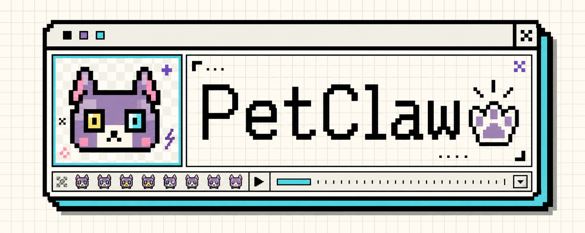
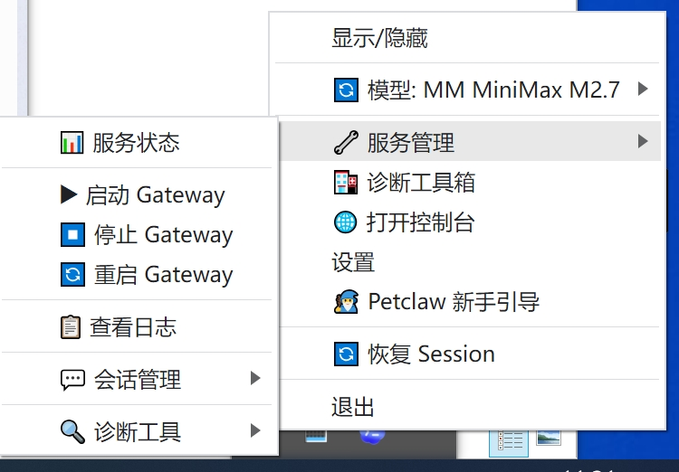
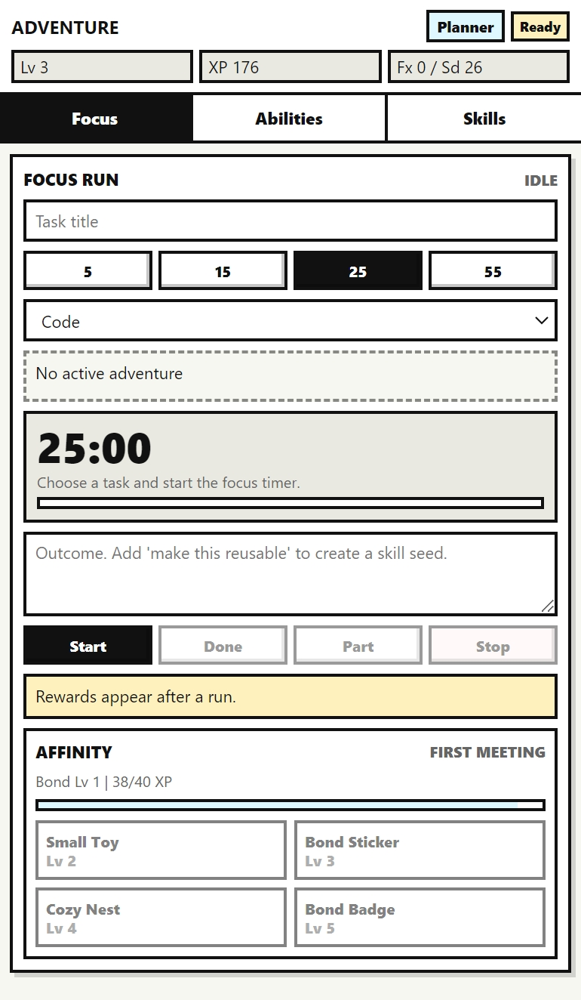
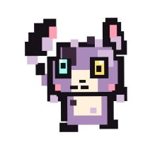
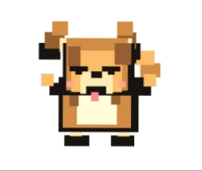
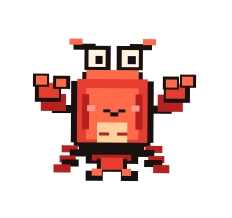
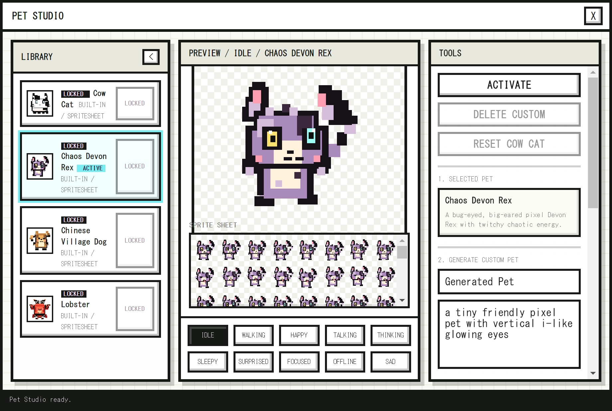
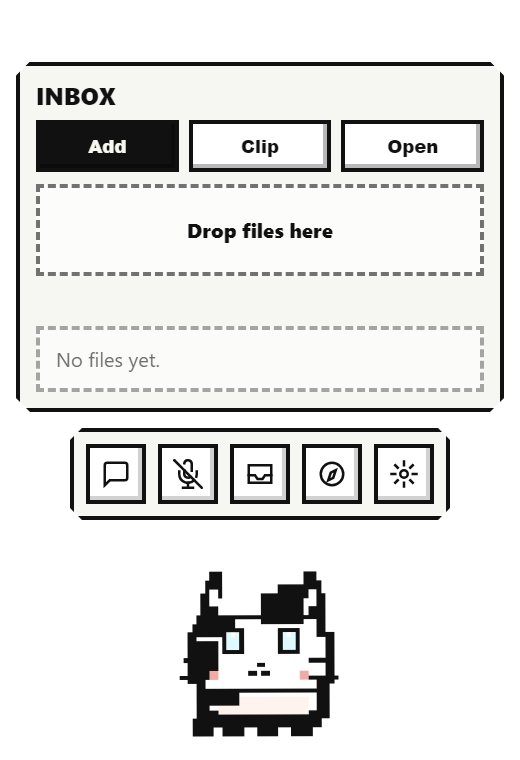
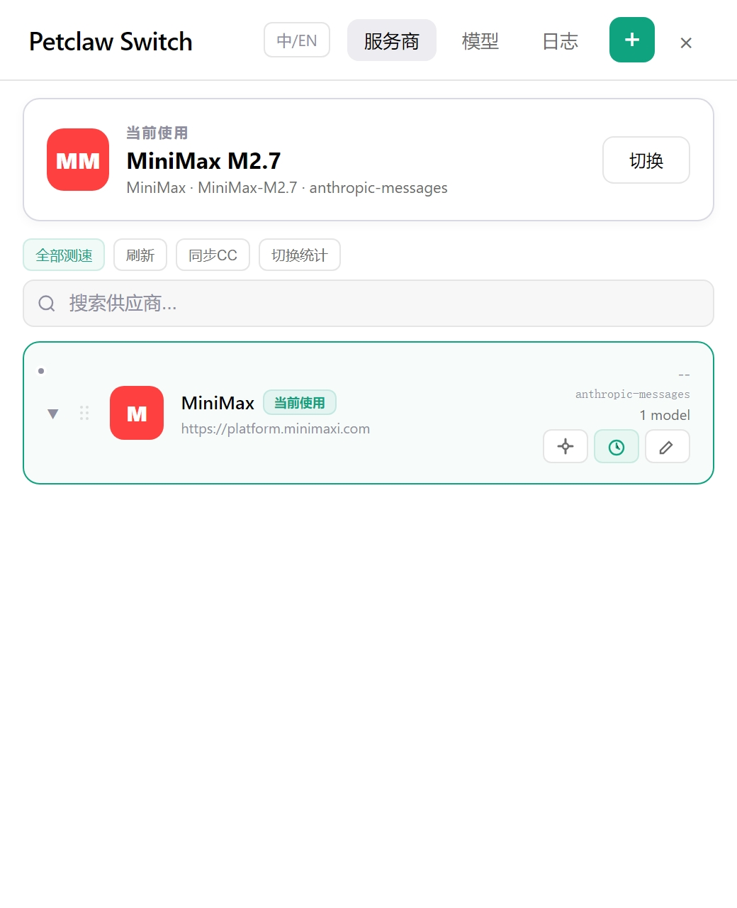
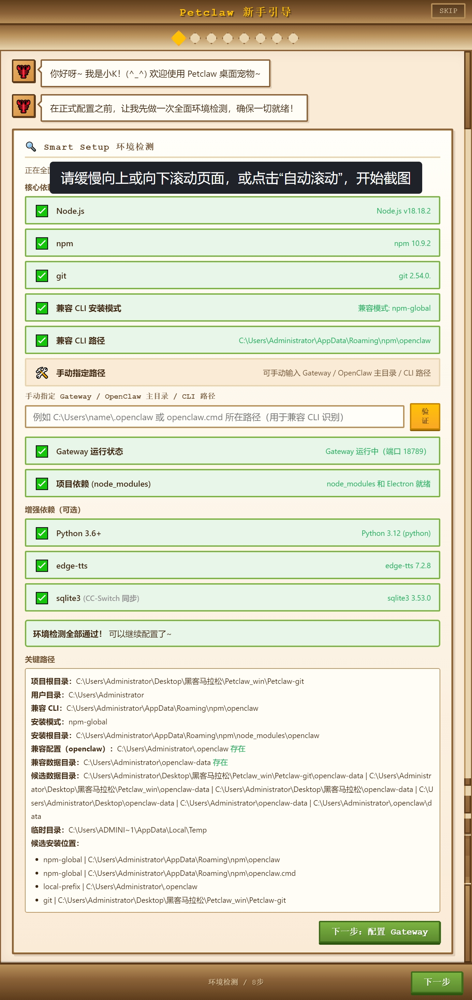

# Petclaw Desktop Pet

Petclaw 是一个桌面 AI 宠物应用。

它想解决的不是“怎么再做一个聊天窗口”，而是另一个问题：

**如果 AI 一直陪在桌面上，它应该长什么样？它应该怎么回应你？它能不能慢慢变得像你的伙伴？**

Petclaw 的答案是：给 OpenClaw / Hermes 一个桌面身体。

它会变成一只小宠物，常驻在你的屏幕边上。你写代码、查资料、整理文件、和 AI 对话的时候，它就在旁边：会动，会说话，会显示字幕，会替你守住后端，也会把你的一次次专注工作变成成长、记忆和技能。

不是冷冰冰的工具。

是一只会陪你干活的小东西。✨

- 版本：3.7.1
- 平台：Windows / macOS
- 技术栈：Electron 28、Node.js 18+
- 协议：MIT

[在线演示](https://kk43994.github.io/petclaw/) ·
[下载最新版](https://github.com/kk43994/petclaw/releases) ·
[配置教程](docs/CONFIGURATION-GUIDE.md)

<p align="center">
  
</p>

🎬 [观看 OpenClaw 对话演示](docs/videos/readme/openclaw-demo.mp4) ·
🎬 [观看基础对话演示](docs/videos/readme/chat-demo.mp4) ·
🎬 [观看专注冒险演示](docs/videos/readme/focus-adventure-demo.mp4)

---

## 一句话讲清楚

Petclaw 是一个把 AI 后端变成桌面宠物的应用。

它有三层体验：

1. **桌面陪伴层**：宠物在桌面上显示状态、说话、思考、专注、离线。
2. **工作连接层**：它连接 OpenClaw / Hermes，帮你启动 Gateway、看状态、查日志、切模型。
3. **游戏化成长层**：你完成的专注工作，会变成宠物的 XP、记忆水晶、技能种子和亲密度。

换句话说，Petclaw 不只是“AI 能回答我”。

它更关心的是：

**AI 有没有在场？有没有陪你完成事情？有没有留下共同经历？**

---

## 打开 Petclaw 后，会发生什么？

第一次启动时，你先告诉 Petclaw 要连接哪个 AI 后端：OpenClaw、Hermes，或者让它自动判断。

然后它会帮你把 Gateway 拉起来，检查端口、进程、API Server 状态和日志路径。后端准备好之后，一只桌面宠物会出现。

它不会打断你。

它只是待在那里，像一个轻量的桌面伙伴：

- AI 在回复时，它会进入 talking 状态。💬
- AI 在处理请求时，它会进入 thinking 状态。🤔
- 你开启专注时，它会进入 focused 状态。🎯
- 后端不可用时，它会进入 offline 状态。🌙
- 你完成一段工作后，它会开心一下，并把这次经历记下来。✨

你不用一直盯着终端，也不用反复切窗口。Petclaw 把 AI 的状态变成桌面上能感知到的动作。

<p align="center">
  
</p>

---

## 重点不是计时，是成长

Petclaw 的游戏化不是“加几个积分”和“做一个排行榜”。

它想做的是一条更自然的成长线：

你和宠物一起开始一段工作。

宠物知道你正在做什么。

你结束工作时，它把这次经历带回来。

这些经历会留下来，变成宠物的成长、记忆和技能。

一次专注冒险大概是这样：

```text
选择任务意图
-> 设置 5 / 15 / 25 / 55 分钟
-> 宠物进入 focused 状态
-> 你开始工作
-> 中途宠物安静陪伴
-> 结束时选择 completed / partial / interrupted
-> 结算 XP、能力碎片、星尘
-> 如果写了总结，生成记忆水晶
-> 如果总结像可复用流程，生成技能种子
-> 亲密度同步增加
```

这条线把“我刚才认真工作了一会儿”变成了一个桌面上能看见、能积累的结果。

它不是冷冰冰的计时记录。

更像是宠物真的陪你完成过一件事。🐾

<p align="center">
  
</p>

🎬 [观看专注冒险完整流程](docs/videos/readme/focus-adventure-demo.mp4)

---

## 宠物会成长

专注结束后，Petclaw 会结算奖励。

这些奖励各有意义：

| 奖励 | 它代表什么 |
| --- | --- |
| `focusXp` | 宠物真的因为陪你工作而成长 |
| `abilityFragments` | 用来解锁能力树 |
| `stardust` | 一点轻量的完成感奖励 |
| 记忆水晶 | 这次工作留下的一段共同记忆 |
| 技能种子 | 某个可复用工作流的雏形 |
| 亲密度 | 你和宠物之间的关系变近一点 |

宠物等级不是装饰。它对应 Petclaw 对工作理解的逐步推进：

| 阶段 | 感觉 |
| --- | --- |
| Companion | 它先成为能陪你说话的伙伴 |
| Observer | 它开始观察任务、项目和会话信号 |
| Planner | 它能在专注结束后帮你想下一步 |
| Operator | 它开始靠近可执行工作流 |
| Skillbearer | 它能沉淀技能卡和可复用方法 |

Petclaw 的想象力在这里：宠物不是只变得“等级更高”，而是更懂你怎么工作。

---

## 记忆水晶：让工作留下痕迹

如果你在专注结束时写了总结，Petclaw 会把这次工作变成一颗记忆水晶。

它保存的不是一句空泛的鼓励，而是这次工作本身：

- 你做了什么任务。
- 这个任务属于 Code、Writing、Research、Learning、Planning、Admin 还是 Rest。
- 最后是完成、部分完成，还是中断。
- 你写下了什么总结。
- 宠物从这次工作里获得了什么奖励。

久而久之，Petclaw 会积累一串“我们一起做过的事”。

这就是它和普通工具不一样的地方。

普通工具只关心这次输入和这次输出。

Petclaw 会关心你们一起经历过什么。💎

专注冒险面板里会承载这些共同经历。后续如果有更完整的记忆水晶视觉，可以继续替换为专门的记忆展示图。

---

## 技能种子：把一次流程变成可复用能力

有些工作不是一次性的。

比如你写了一段总结：

```text
先检查错误日志，再对比配置，再跑测试，最后整理成报告。
```

这就不只是一次结果，它像是一个可复用流程。

Petclaw 会尝试把这种总结识别成技能种子。等条件满足后，技能种子可以进一步变成技能卡。

也就是说，宠物不是只在旁边看你工作。

它会慢慢收集你做事的方法。

```text
一次专注
-> 一段总结
-> 一颗记忆水晶
-> 一个技能种子
-> 一张技能卡
-> 宠物学会一种工作方式
```

这是 Petclaw 游戏化里最有意思的一层：它不是让你为了积分工作，而是把你已经做过的工作沉淀成未来可复用的能力。🧩

技能种子和技能卡也会进入宠物成长线。后续如果录制“从总结生成技能种子”的流程，可以放在这里。

---

## 亲密度：它会和你更熟一点

Petclaw 还有一条亲密度线。

这不是战斗力，也不是付费点。它表达的是你和宠物之间的关系温度。

它只增长，不衰减，不惩罚用户。你离开几天，宠物不会责怪你。它只记录正向互动：

- 你点击它。
- 你和它聊天。
- 你用语音互动。
- 你完成一次专注。
- 你生成一颗记忆水晶。

亲密度提升后，会解锁羁绊物品：

| 等级 | 名称 | 解锁 |
| --- | --- | --- |
| 1 | First Meeting | 初见 |
| 2 | Familiar | Small Toy |
| 3 | Close | Bond Sticker |
| 4 | Trusted | Cozy Nest |
| 5 | Bonded | Bond Badge |

这部分不是为了做复杂养成游戏。

它只是想让你感觉：这只宠物不是每次打开都重置。你们之间有一点连续性，有一点熟悉感。🧡

亲密度和羁绊物品会和专注成长一起，构成 Petclaw 的长期陪伴反馈。

---

## 它有自己的样子

Petclaw 当前内置四只初始宠物：

- **Cow Cat**：轻快、亲近，适合作为默认陪伴。
- **Chaos Devon Rex**：大耳朵，表情更跳，存在感更强。
- **Chinese Village Dog**：暖一点，稳一点，像长期伙伴。
- **Lobster**：有辨识度，带一点轻松的项目性格。

<table>
  <tr>
    <td align="center" width="25%">
      <br>
      <b>Cow Cat</b>
    </td>
    <td align="center" width="25%">
      <br>
      <b>Chaos Devon Rex</b>
    </td>
    <td align="center" width="25%">
      <br>
      <b>Chinese Village Dog</b>
    </td>
    <td align="center" width="25%">
      <br>
      <b>Lobster</b>
    </td>
  </tr>
</table>

每只宠物都不是静态贴图，而是有一组状态动画：

```text
idle / happy / talking / thinking / sleepy
surprised / focused / offline / sad / walking
```

这些状态会随着桌面事件变化。

你不需要手动切换。它会自己表达当前正在发生什么。

---

## 你可以造一只自己的宠物

Petclaw 有一个宠物工作室。

你可以从内置宠物里切换，也可以导入本地图片，或者通过图片生成接口生成新的宠物 spritesheet。生成后的宠物会有自己的资源目录、`pet.json`、生成提示词和任务记录。

这意味着 Petclaw 不只是“给你四个可选形象”。

它更接近一个桌面宠物容器：你可以慢慢把它变成自己的东西。

<p align="center">
  
</p>

🎬 [观看宠物工作室演示](docs/videos/readme/pet-studio-demo.mp4)

---

## 它会替你守着 AI 后端

很多桌面 AI 工具的问题，不是功能少，而是链路容易断：后端没启动、端口被占用、API Server 没开、日志不知道去哪看。

Petclaw 把这件事收进了 Gateway。

你可以让它连接 OpenClaw，也可以连接 Hermes；如果不想选，就用 Auto 模式。Petclaw 会探测可用后端，启动 Gateway，检查端口和进程归属，并在状态异常时给出诊断。

常用命令：

```bash
npx petclaw gateway
npx petclaw gateway status
npx petclaw gateway logs --tail 80
npx petclaw doctor --json
npx petclaw dashboard
```

Petclaw 会处理这些事：

- 启动 OpenClaw 或 Hermes Gateway。
- 识别 `openclaw`、`hermes`、`auto` 三种兼容模式。
- 检查 CLI 路径、端口、进程和 API Server 状态。
- 查看日志、重启服务、停止服务。
- 在桌面端和 CLI 里给出明确状态。

<p align="center">
  
</p>

Gateway 的状态更适合通过状态栏工具和新手引导来理解：它不是一次对话演示，而是 Petclaw 在后台帮你把后端链路守住。

---

## 它能说话，也能把话放到桌面上

Petclaw 的语音不是“能播一下音频”这么简单。它支持 MiniMax 声音克隆、预设音色、Edge TTS 降级、情绪语气、自然停顿、播放队列和重复消息过滤。

你可以把它理解成 AI 回复的表达层：

- 文本回复负责内容。
- 字幕负责让你快速看见。
- 语音负责让 AI 有存在感。
- 宠物状态负责告诉你它正在说、正在想，还是暂时离线。

需要注意的是：AI 回复能不能播报，取决于后端或 Agent 是否调用 Petclaw 的桌面桥接能力。单纯产生文字，不等于已经触发语音。

🎬 [观看 OpenClaw 对话演示](docs/videos/readme/openclaw-demo.mp4)

🎬 [观看基础对话与表达演示](docs/videos/readme/chat-demo.mp4)

---

## 它能帮你接住桌面上的材料

工作的时候，你经常会遇到一些“等会儿要给 AI 看”的东西：一张图、一个 PDF、一段剪贴板文本、一个链接、一个压缩包。

Petclaw 的 Inbox 就是为这种瞬间准备的。

你把文件拖进去，或者从剪贴板收纳，它不会移动你的原文件，而是复制一份到本地 Inbox：

```text
Documents/Petclaw Inbox/YYYY-MM-DD/<type>/
```

这个功能的价值不是“多了一个文件夹”。

真正有用的是：桌面宠物不只是聊天入口，它也开始变成你和 AI 之间的素材入口。

<p align="center">
  
</p>

🎬 [观看 Inbox 收纳演示](docs/videos/readme/inbox-demo.mp4)

---

## 它也能管理模型

Petclaw 提供模型和 Provider 管理界面。你可以添加 Provider，管理模型，测试延迟，热切换模型，并在失败时自动回滚。

模型切换不应该是一次重启。

Petclaw 把 Provider、模型、测速、切换历史和回滚都放进同一套管理流程里，让桌面端能更稳地接住不同模型。

<p align="center">
  
</p>

---

## 第一次使用不会从空白开始

Petclaw 提供配置向导和诊断工具，帮你把后端、模型、消息渠道、语音、显示和全链路测试串起来。

配置向导负责把用户带进来。

诊断工具负责在出问题时告诉你问题在哪。

<p align="center">
  
</p>

---

# 技术实现细节

上面讲的是 Petclaw 想给用户什么感觉。

下面讲它是怎么跑起来的。

这部分会更偏工程实现：桌面窗口怎么管理、宠物状态怎么变化、AI 后端怎么接入、语音字幕怎么播、日志和安全边界怎么处理。

---

## 桌面层：Electron 多窗口桌面伴侣

Petclaw 基于 Electron 构建。主进程负责创建和管理桌面宠物窗口、字幕窗口、配置向导窗口、诊断窗口、模型设置窗口和宠物工作室窗口。

桌面宠物窗口保持轻量、置顶、可拖动。字幕窗口则走鼠标穿透逻辑，像桌面歌词一样浮在屏幕上，但不影响用户点击后面的软件。

这套设计的关键不是“多开几个窗口”，而是把不同职责拆开：

- 宠物窗口负责存在感和状态表达。
- 字幕窗口负责 AI 回复的轻量呈现。
- 配置向导负责首次上手。
- 诊断窗口负责排查问题。
- 模型设置窗口负责管理 Provider 和模型。
- 宠物工作室负责外观、导入和生成。

这样 Petclaw 不会把所有功能塞进一个笨重主界面，而是保持桌面宠物本身足够轻。

---

## 宠物层：manifest + spritesheet 状态系统

Petclaw 的宠物不是写死在页面里的单个形象，而是通过 manifest 管理。

每只宠物都有自己的 `pet.json`，里面描述名称、来源、渲染方式、资源目录、spritesheet 布局和状态动画。当前内置宠物使用 `8 列 x 10 行` 的 spritesheet，每一行对应一种状态。

核心状态包括：

```text
idle / happy / talking / thinking / sleepy
surprised / focused / offline / sad / walking
```

这些状态和产品体验直接绑定：

- AI 回复时进入 `talking`。
- 请求处理中进入 `thinking`。
- 专注冒险开始后进入 `focused`。
- 后端不可用时进入 `offline`。
- 完成任务或解锁奖励时进入 `happy` 或 `surprised`。

宠物工作室则基于这套结构扩展：用户可以切换内置宠物、导入本地图片，或者通过 AI 生成新的 spritesheet，再保存成新的宠物资源。

---

## AI 后端层：OpenClaw / Hermes / Auto

Petclaw 支持三种兼容模式：

| 模式 | 说明 |
| --- | --- |
| `openclaw` | 强制使用 OpenClaw |
| `hermes` | 强制使用 Hermes |
| `auto` | 自动探测可用后端 |

兼容模式可以来自环境变量，也可以来自 `pet-config.json`。如果用户不想手动选择，Petclaw 会根据本地环境探测 OpenClaw 或 Hermes 的可用状态。

这部分的重点是：Petclaw 不直接假设后端一定可用。它会检查 CLI、配置目录、API Server、端口和进程归属，尽量避免“界面打开了，但根本不能聊”的半可用状态。

---

## Gateway 守护层：启动、探活、日志和恢复

Gateway 是 Petclaw 和 AI 后端之间的运行通道。

它负责：

- 启动兼容后端。
- 检查端口是否可用。
- 判断进程是否属于当前 Gateway。
- 读取和展示日志。
- 检查 API Server 状态。
- 在异常时给出诊断和恢复入口。

命令行也提供对应入口：

```bash
npx petclaw gateway
npx petclaw gateway status
npx petclaw gateway logs --tail 80
npx petclaw doctor --json
npx petclaw dashboard
```

这里复用了早期项目里经过验证的守护思路：不要只靠“启动命令成功”判断服务正常，而是要持续看端口、进程、健康状态和日志。这样用户遇到问题时，Petclaw 能告诉他“哪里坏了”，而不是只显示一个失败。

---

## 语音与字幕层：让 AI 的回复有表达感

Petclaw 的语音链路包括：

- MiniMax 声音克隆。
- 预设音色。
- Edge TTS 降级。
- 情绪语气处理。
- 自然停顿标记。
- 播放队列。
- 重复消息过滤。

字幕窗口会同步显示 AI 回复，形成类似桌面歌词的效果。语音和字幕不是 Petclaw 的装饰，而是“陪伴感”的关键：AI 不只是返回一段文本，它会用声音和状态出现在桌面上。

同时，Petclaw 也保留了一个重要边界：AI 是否播报，取决于后端或 Agent 是否主动调用桌面桥接能力。这样可以避免所有文字都被强行朗读，也方便用户控制体验。

---

## 模型管理层：Provider、测速、热切换和回滚

Petclaw 提供独立的模型设置界面，用来管理 Provider 和模型。

支持能力包括：

- 添加、编辑、删除 Provider。
- 从预设快速添加模型。
- 测试模型延迟。
- 在不同模型之间热切换。
- 记录切换历史。
- 失败时自动回滚到上一个可用模型。
- 与 CC-Switch 同步配置。

这部分让 Petclaw 不只是一个固定后端的宠物外壳，而是可以跟随用户的模型选择动态切换。

---

## 数据与游戏化层：进度、记忆、技能和亲密度

Petclaw 的游戏化数据主要由几类模块负责：

- `focus-adventure.js`：专注冒险的开始、计时、结束和奖励计算。
- `pet-progress.js`：宠物等级、专注 XP、星尘、能力碎片、记忆和技能数据。
- `pet-abilities.js`：能力树、等级阈值和解锁规则。
- `pet-skills.js`：记忆水晶、技能种子、技能卡。
- `pet-affinity.js`：亲密度 XP、每日上限、羁绊物品。

这里的设计原则是：不要把游戏化做成压力系统。

所以亲密度只增长，不衰减；专注中断也不会羞辱用户；奖励更多是记录和反馈，而不是惩罚与排名。Petclaw 关心的是让用户愿意回来，而不是逼用户打卡。

---

## Inbox 文件层：把桌面材料接进 AI 工作流

Inbox 是 Petclaw 的本地文件收纳系统。它不会移动或删除用户原文件，而是复制一份到：

```text
Documents/Petclaw Inbox/YYYY-MM-DD/<type>/
```

它会根据文件扩展名分类图片、文档、表格、演示文稿、文本、代码、链接、压缩包和其他文件。

这个模块让 Petclaw 从“聊天入口”扩展成“素材入口”。用户看到一个想交给 AI 的东西，不需要先整理路径和目录，可以先收进 Inbox，后续再处理。

---

## 安全与稳定层：IPC 白名单、本地配置和日志脱敏

Petclaw 是桌面应用，会接触本地文件、命令、配置和密钥，所以安全边界很重要。

当前实现里有几条基本原则：

- 渲染进程不能直接随意调用 Node.js 能力。
- `preload.js` 只暴露白名单 IPC channel。
- 外部命令尽量使用参数数组，不拼接命令字符串。
- 本地配置放在 `pet-config.json`，不提交到仓库。
- API Key、Token 等敏感信息需要走安全存储或运行时配置。
- 日志输出要做敏感信息脱敏。
- 日志轮转和错误处理避免控制台刷屏。

这些细节不一定是用户第一眼会看到的功能，但它们决定了 Petclaw 能不能作为一个长期运行的桌面伙伴，而不是一个只适合演示的玩具。

---

## 快速开始

### 环境要求

- Windows 10/11 或 macOS
- Node.js 18+
- npm
- OpenClaw 或 Hermes 兼容后端

### 安装依赖

```bash
npm install
```

### 启动桌面应用

```bash
npm start
```

开发模式：

```bash
npm run dev
```

### CLI

```bash
npx petclaw --version
npx petclaw gateway
npx petclaw doctor
npx petclaw dashboard
```

---

## 本地配置

本地配置文件是 `pet-config.json`。它不会提交到仓库，可以参考 `pet-config.example.json`。

```json
{
  "compatMode": "auto",
  "petName": "Petclaw",
  "userName": "User",
  "voice": {
    "enabled": true
  },
  "appearance": {
    "activePetId": "lobster"
  }
}
```

AI 生成宠物会用到这些环境变量：

| 变量 | 用途 |
| --- | --- |
| `PETCLAW_IMAGE_API_KEY` | 图片生成 API Key |
| `OPENAI_API_KEY` | 备用图片生成 API Key |
| `PETCLAW_IMAGE_BASE_URL` | OpenAI 兼容图片接口 base URL |
| `PETCLAW_IMAGE_API_URL` | 图片编辑接口完整 URL |
| `PETCLAW_IMAGE_GENERATION_API_URL` | 图片生成接口完整 URL |
| `PETCLAW_IMAGE_MODEL` | 图片生成模型 |
| `PETCLAW_IMAGE_SIZE` | 图片生成尺寸 |
| `PETCLAW_IMAGE_QUALITY` | 图片生成质量 |

---

## 项目结构

```text
.
├── main.js                     # Electron 主进程
├── preload.js                  # 渲染进程安全桥接
├── index.html                  # 桌面宠物主 UI
├── lyrics.html                 # 字幕窗口
├── bin/petclaw.js              # petclaw CLI
├── pet-appearance.js           # 宠物外观 manifest 与内置宠物
├── pet-image-generator.js      # AI 生成宠物与 spritesheet 处理
├── pet-progress.js             # 宠物成长进度
├── pet-abilities.js            # 等级与能力树
├── pet-skills.js               # 技能种子、技能卡、记忆水晶
├── pet-affinity.js             # 亲密度与羁绊物品
├── focus-adventure.js          # 专注冒险
├── inbox-system.js             # 本地 Inbox 收纳
├── voice/                      # TTS 引擎
├── utils/                      # 后端兼容、安全、日志、模型、Gateway 工具
├── assets/pets/                # 内置和自定义宠物资源
├── tests/__tests__/            # Jest 单元测试
├── docs/                       # 用户文档、图片与演示资源
└── docs-dev/                   # 开发记录、发布记录、方案文档
```

---

## 测试与构建

```bash
npm test
npm run test:ci
npm run build:win
npm run build:mac
```

---

## 相关文档

- [配置教程](docs/CONFIGURATION-GUIDE.md)
- [项目结构](PROJECT-STRUCTURE.md)
- [智能语音系统](docs-dev/SMART-VOICE.md)
- [模型热切换](docs-dev/SYNC-GUIDE.md)
- [文件收纳设计](docs/superpowers/specs/2026-05-07-file-inbox-helper-design.md)

---

## License

MIT
